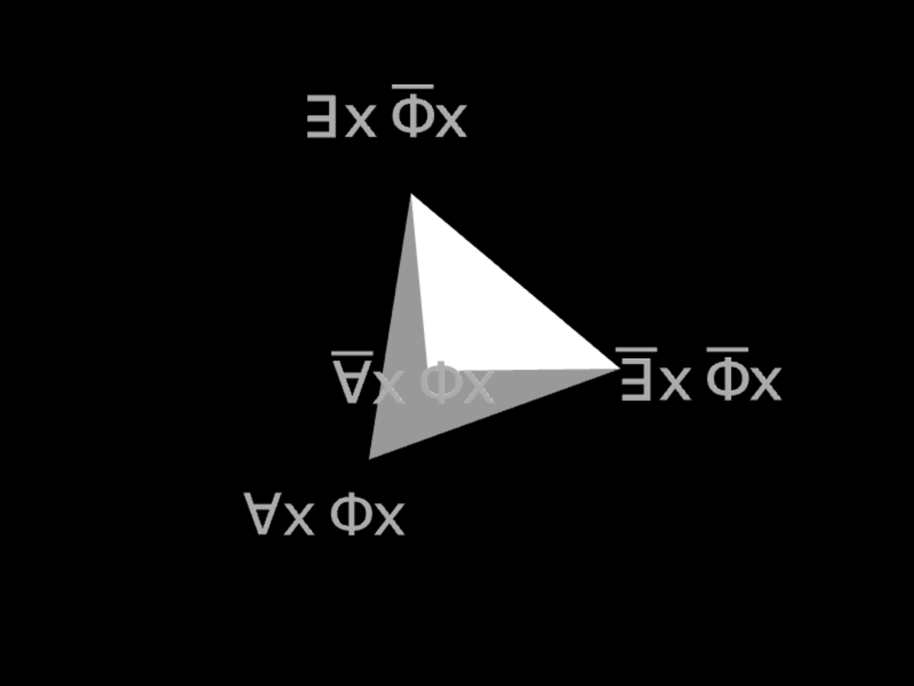
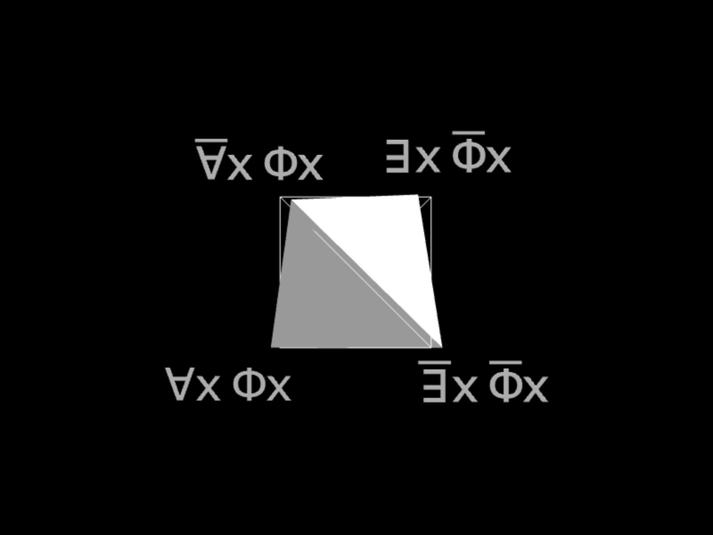

# Tetralogic

Simple Vue 3 + TypeScript + Vite +
Threejs static web app that allows to rotate a tetrahedron with 3D symbols attached to its vertices.

The symbols always face the user by compensating the global rotation :

The rotation is performed using an arcball track style control algorithm.

A "ghost" tetrahedron allows to preview the closest square facing orientation when close enough :

The actual tetrahedron is slerp'ed to this preview orientation on release using axis angle rotation.